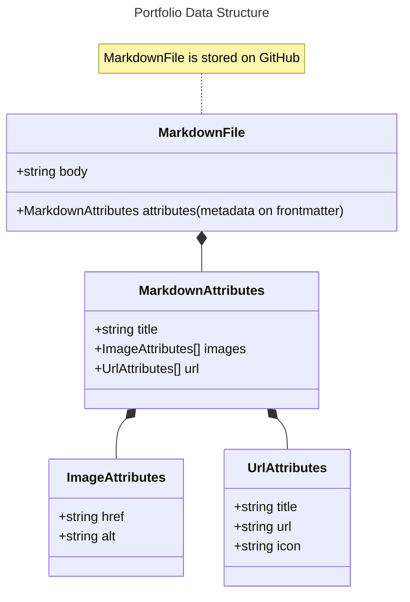

# Current Version of My Homepage

using React.js, tailwindcss, Three.js

# Data Structure

```mermaid
---
title: Portfolio Data Structure
---
classDiagram
    note for MarkdownFile "MarkdownFile is stored on GitHub"
    MarkdownFile *-- MarkdownAttributes
    MarkdownAttributes *-- ImageAttributes
    MarkdownAttributes *-- UrlAttributes
    class MarkdownFile {
        +MarkdownAttributes attributes(metadata on frontmatter)
        +string body
    }
    class MarkdownAttributes {
        +string title
        +ImageAttributes[] images
        +UrlAttributes[] url
    }
    class ImageAttributes {
        +string href
        +string alt
    }
    class UrlAttributes {
        +string title
        +string url
        +string icon
    }
```
